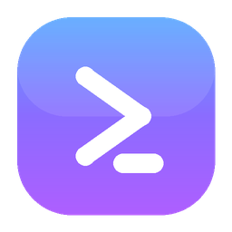
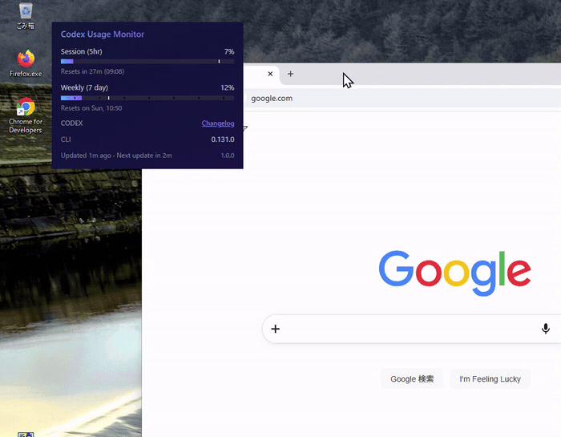
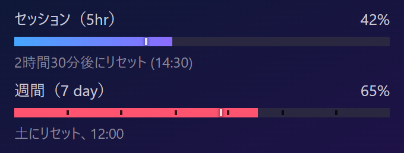
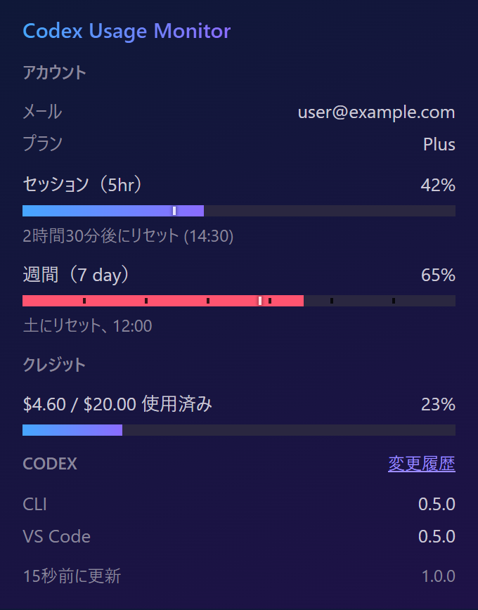
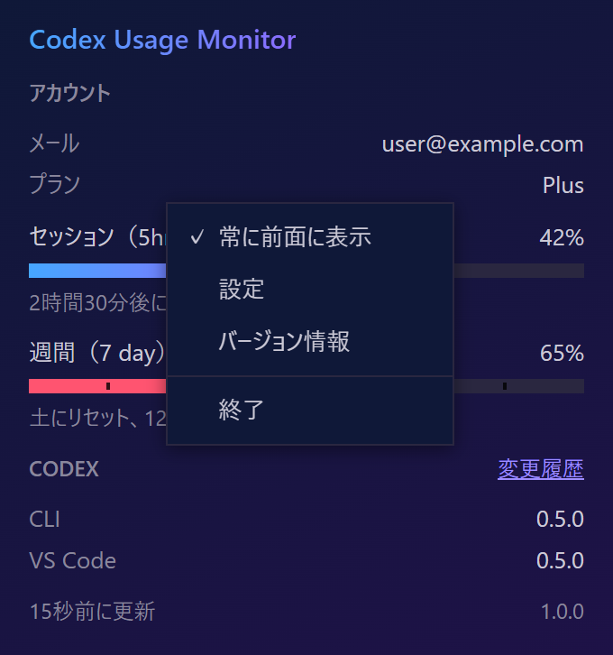
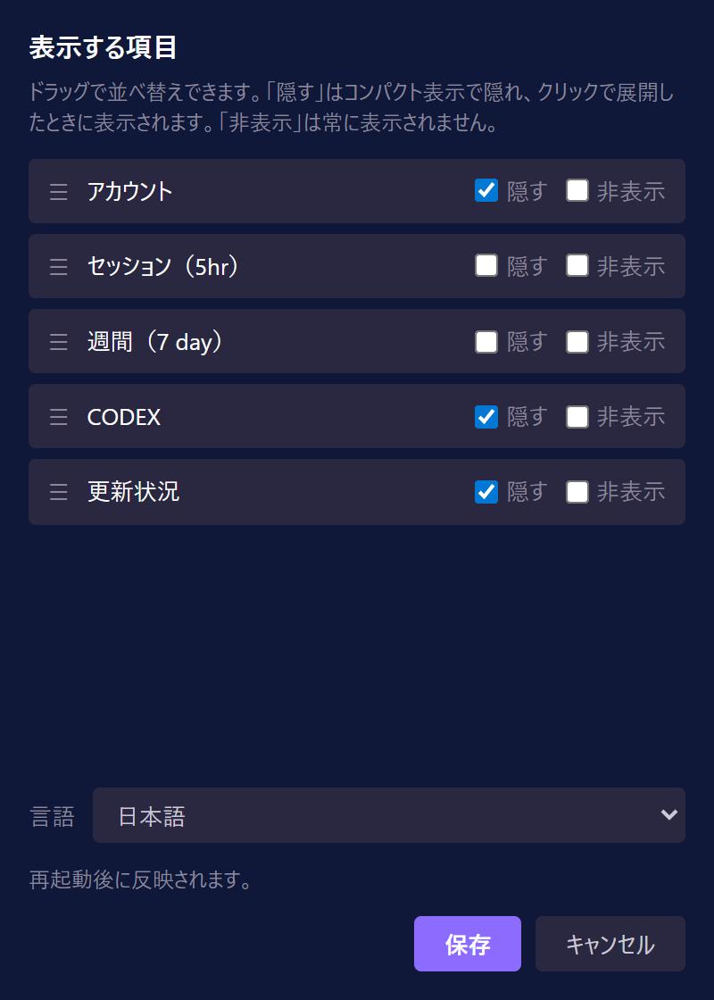
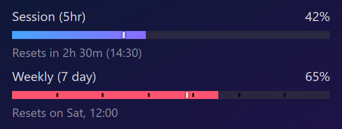
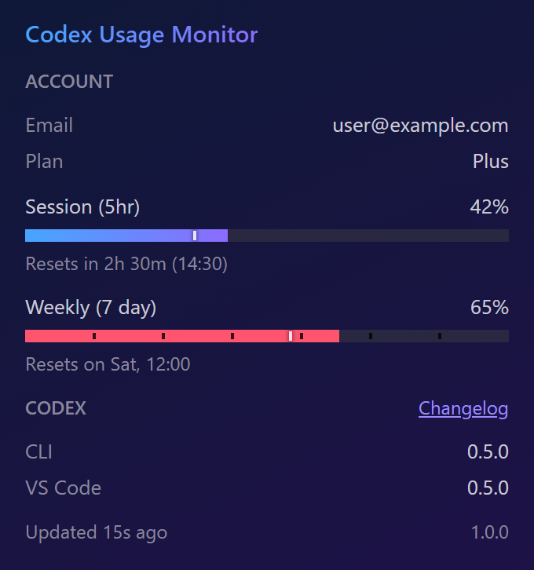
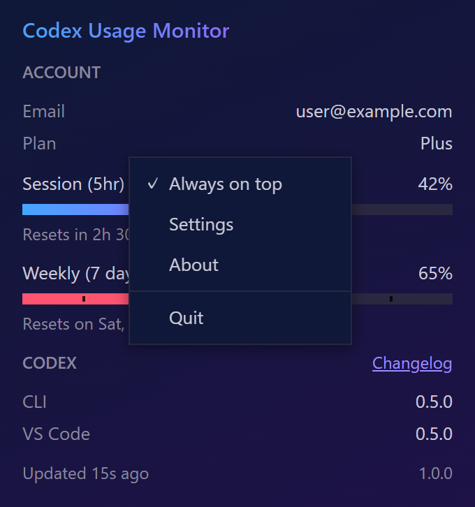
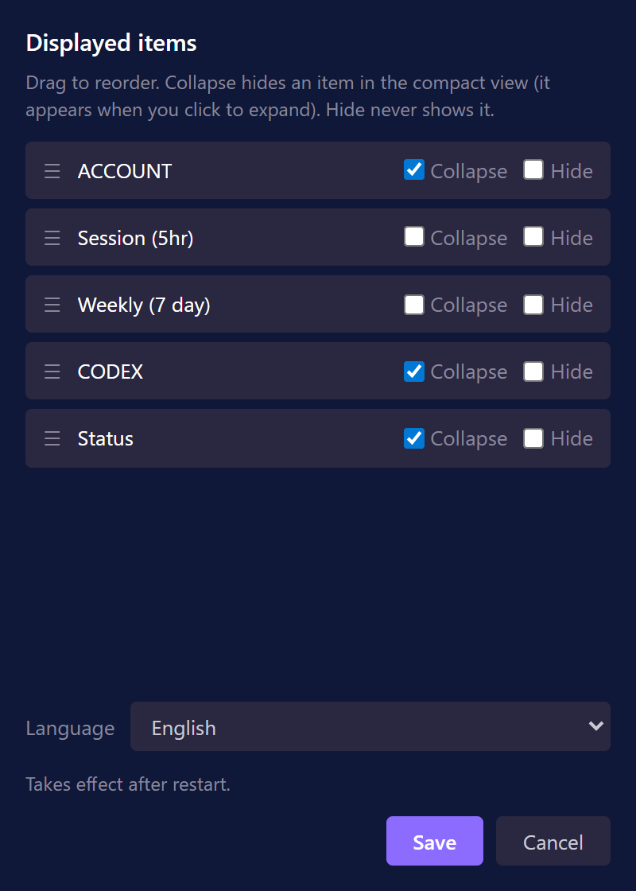

#  Codex Usage Monitor

> OpenAI Codex（ChatGPTプラン）のレート制限の使用量を常時画面に表示する、常駐型のデスクトップウィジェット（Windows）。
> A resident, always-on-top desktop widget that keeps your OpenAI Codex (ChatGPT-plan) rate-limit usage on screen (Windows).

<p align="center">
  
  <br>
  <sub>コンパクト⇄拡大の切り替えと、常に前面に表示 / Compact ⇄ expanded, always on top</sub>
</p>

## ダウンロード / Download

最新の `CodexUsageMonitor.exe` は [Releases](https://github.com/omi-last-stand/codex-usage-monitor/releases) から入手できます。インストール不要で、単体のexeだけで動作します（設定・状態ファイルは任意）。自分でビルドする場合は下記「ソースからビルド」を参照してください。

Get the latest `CodexUsageMonitor.exe` from the [Releases](https://github.com/omi-last-stand/codex-usage-monitor/releases) page. No installation - it runs as a single standalone EXE (settings/state files are optional). To build it yourself, see "Building from source" below.

## 概要 / Overview

**[日本語](#日本語) ・ [English](#english)**

本アプリは [Claude Usage Monitor](https://github.com/omi-last-stand/claude-usage-monitor) を OpenAI Codex 向けに作り替えたものです。Claude Usage Monitor は Jens Duttke 氏の [Usage Monitor for Claude](https://github.com/jens-duttke/usage-monitor-for-claude) のフォークです。両者の素晴らしい仕事に深く感謝します。
This app is an adaptation of [Claude Usage Monitor](https://github.com/omi-last-stand/claude-usage-monitor) for OpenAI Codex. Claude Usage Monitor is itself a fork of [Usage Monitor for Claude](https://github.com/jens-duttke/usage-monitor-for-claude) by Jens Duttke. With sincere gratitude to both.

---

<a id="日本語"></a>

## 日本語

Codex CLI・ChatGPT デスクトップ・各IDE拡張で共有される Codex のレート制限の残量を、デスクトップ上に常時表示します。Codex CLI 自身が `/status` で参照しているのと同じ使用量データを読み取り、**閉じない常駐ウィジェット**として表示します。

### スクリーンショット

<table>
<tr>
<td align="center" valign="top"><br><sub><b>コンパクト表示</b>：使用量バーだけ</sub></td>
<td align="center" valign="top"><br><sub><b>クリックで展開</b>：詳細を表示</sub></td>
</tr>
<tr>
<td align="center" valign="top"><br><sub><b>右クリックメニュー</b></sub></td>
<td align="center" valign="top"><br><sub><b>設定ウィンドウ</b>：3状態＋並べ替え</sub></td>
</tr>
</table>

### このアプリの特徴

- **常駐ウィジェット**：ポップアップが閉じず、常に前面に表示され続けます
- **コンパクト表示／クリックで展開**：通常は使用量バーだけをコンパクトに表示。クリックすると詳細（アカウント・隠し項目・更新状況など）が開きます
- **位置と表示状態を記憶**：ウィンドウ位置と、コンパクト/拡大のどちらで使っていたかを `CodexUsageMonitor.ini` に保存し、次回起動時に復元。ドラッグで自由に移動でき、画面外の座標は自動で見える位置に補正。初回はなければ画面中央にコンパクトで表示
- **右クリックメニュー**：常に前面に表示（切替）／設定／バージョン情報／終了
- **設定ウィンドウ**：表示するブロック（アカウント・各使用量バー・クレジット・Codex CLIバージョン・更新状況）を「表示／隠す／非表示」の3状態で選び、ドラッグで並べ替え。結果は ini に保存
- **レジストリ不使用**：設定・状態はすべて exe と同じフォルダのファイルに保存します
- **バージョン情報**：クリック可能なリンク付き（タスクダイアログ）

### 主な機能

- 使用量バー：Codex の**主要枠**（ローリング5時間）と**週次枠**（7日間）を表示。クレジット残高がある場合は残高（または「無制限」）を**テキストで表示**
- しきい値アラート（経過時間を考慮するスマートモード対応）・リセット通知
- 2つのデータソース：ライブAPI（`chatgpt.com`）と、ネットワーク不要のローカルセッションファイル。`usage_source` で切替可能
- 状況に応じた適応的ポーリング（アクティブ時は高頻度、アイドル／ロック時は休止）
- 13言語対応（Windowsの表示言語から自動判定、手動上書きも可）
- イベントコマンド（リセット・しきい値・起動時に任意コマンドを実行）

### 必要環境

- **Windows 10 / 11（64bit）**
- **[Codex CLI](https://developers.openai.com/codex/cli)** がインストール済みで、`codex login` でログイン済みであること。本アプリは Codex CLI がローカルに保存したOAuth認証情報（`~/.codex/auth.json`、`CODEX_HOME` 指定時はそちら）を読み取ります。

### 入手と実行

**単体のexeだけで動きます。** インストール不要・追加ファイル不要です。`CodexUsageMonitor.exe` を好きな場所に置いて実行するだけです。状態ファイル（`CodexUsageMonitor.ini`）はアプリが exe と同じフォルダに自動生成し、詳細設定ファイル（`usage-monitor-settings.json`）は任意で、置けば読み込みます。どちらが無くても既定値で動作します。

- プレビルド版は本リポジトリの [Releases](https://github.com/omi-last-stand/codex-usage-monitor/releases) から入手できます（公開されている場合）。
- 自分でビルドする場合は後述の「ソースからビルド」を参照してください。

### 使い方

| 操作 | 動作 |
|---|---|
| ウィジェットを**クリック** | コンパクト表示と詳細表示を切り替え |
| ウィジェットを**ドラッグ** | 自由に移動（位置は記憶されます） |
| **右クリック** | メニュー（常に前面に表示／設定／バージョン情報／終了） |
| ウィジェットの**外側をクリック** | 開いている右クリックメニューを閉じる |

「設定」を開くと、表示する使用量項目を選べます。各項目について「**隠す**」（コンパクト時は隠し、クリックで展開したときに表示）と「**非表示**」（常に表示しない）をチェックでき、行をドラッグして並び順を変更できます。

ウィジェットとは別に、タスクトレイのアイコンを右クリックするとメニューが出ます（設定／バージョン情報／Windows起動時に開始／再起動／終了。イベントコマンドを設定している場合は「イベントコマンドのテスト」も表示）。設定ファイル（後述）を編集したあとは、この「**再起動**」で再読み込みします。

### 設定

設定・状態は **exe と同じフォルダ** のファイルに保存します（レジストリは一切使いません）。どちらも任意で、無ければ既定値で動作します。

- **`CodexUsageMonitor.ini`** … アプリが自動生成・更新するウィジェットの状態（ウィンドウ位置、常に前面の有無、項目の表示設定）。「設定」ウィンドウやドラッグ操作の結果がここに保存されます。
- **`usage-monitor-settings.json`** … 任意の詳細設定（ポーリング間隔・配色・アラートしきい値・言語・データソース・イベントコマンドなど）。ユーザーが手動で作成するファイルで、アプリが書き換えることはありません。アプリはこのファイルを exe と同じフォルダ → `$CODEX_HOME` → `~/.codex` の順に探します。

例（`usage-monitor-settings.json`）：

```json
{
  "poll_interval": 180,
  "usage_source": "auto",
  "bar_fg": "#8b6cff"
}
```

データソースは `usage_source` で選べます（`"auto"`：API→セッションファイルの順、`"api"`：APIのみ、`"session"`：ローカルセッションファイルのみ＝ネットワーク不使用）。詳細設定の一覧は [docs/configuration.md](docs/configuration.md)、イベントコマンドは [docs/event-commands.md](docs/event-commands.md) を参照してください。

### セキュリティと透明性

OAuth認証情報を扱うため、安全性を検証できるよう配慮しています。

- **アプリ自身の通信先は `chatgpt.com` のみ**。これ以外のホストへ自発的に接続することはありません（`api.openai.com` などにも接続しません）。※あなたが設定した[イベントコマンド](docs/event-commands.md)（例: Pushover / Telegram への `curl`）は、あなたが指定した送信先へ使用量情報を送信し得ます
- **認証情報はローカルのみ**：`~/.codex/auth.json` のアクセストークンとアカウントIDを読み取り、HTTPの `Authorization` / `ChatGPT-Account-Id` ヘッダーにのみ使用します。ログ・ファイル・第三者への送信は一切行いません
- **読み取るのはローカルのCodexデータだけ**：認証情報（`~/.codex/auth.json`）と、フォールバック用のセッションファイル（`~/.codex/sessions/.../rollout-*.jsonl`）を読み取ります。アカウントのメールアドレス・プラン名はローカルのIDトークン（JWT）から取り出し、ネットワークは使いません
- **書き込むのは自分の状態だけ**：exe と同じフォルダの `CodexUsageMonitor.ini`（ウィンドウ位置・常に前面・項目表示）のみを書き込みます。認証情報や使用量の値をディスクに書くことはありません
- **トークンの自動更新なし**：Codex のトークン更新は `codex login`（対話式）が必要なため、本アプリは自動更新を行いません。Codex CLI が動作中に自分で `auth.json` を更新します。期限切れの間はローカルのセッションデータにフォールバックして表示を続けます
- **レジストリ不使用**：自動起動の設定もスタートアップフォルダのショートカットで行い、レジストリには触れません
- **動的コード実行なし**（`eval`・`exec` 等を使用しません）・**難読化なし**
- **依存は最小限**：[requests](https://pypi.org/project/requests/)・[Pillow](https://pypi.org/project/pillow/)・[pystray](https://pypi.org/project/pystray/)・[pywebview](https://pypi.org/project/pywebview/) のみ

### ソースからビルド

<details>
<summary>自分でexeをビルドする場合</summary>

必要なもの：Python 3.10以上、pip。

```bash
git clone https://github.com/omi-last-stand/codex-usage-monitor.git
cd codex-usage-monitor
python -m venv .venv
.venv\Scripts\activate
pip install -r requirements.txt
```

ソースから実行：

```bash
python -m usage_monitor_for_codex
```

exeをビルド：

```bash
python build.py
```

`dist/CodexUsageMonitor.exe`（約15MB）が生成されます。Pythonと全依存を内包した単一ファイルです（PyInstaller のスペックは `usage_monitor_for_codex.spec`）。

</details>

### 謝辞

本アプリは [Claude Usage Monitor](https://github.com/omi-last-stand/claude-usage-monitor) を Codex 向けに作り替えたものです。Claude Usage Monitor は Jens Duttke 氏の [Usage Monitor for Claude](https://github.com/jens-duttke/usage-monitor-for-claude) をベースにしています。両者に心より感謝します。

### ライセンス

[MIT License](LICENSE)。本家 Jens Duttke 氏の著作権表示を保持しつつ、フォーク側の著作権を併記しています。

### 免責

本プロジェクトは独立した有志による非公式のものです。[OpenAI](https://openai.com/) による作成・承認・公式サポートを受けたものではありません。「Codex」「OpenAI」「ChatGPT」は OpenAI の商標です。名称は互換性を示す説明目的でのみ使用しています。

---

<a id="english"></a>

## English

Codex Usage Monitor shows your OpenAI Codex (ChatGPT-plan) rate-limit usage on the desktop at a glance. It reads the same usage data the Codex CLI itself shows in `/status`, and keeps it on screen as a **resident widget that stays open**.

### Screenshots

<table>
<tr>
<td align="center" valign="top"><br><sub><b>Compact</b>: just the usage bars</sub></td>
<td align="center" valign="top"><br><sub><b>Click to expand</b>: full details</sub></td>
</tr>
<tr>
<td align="center" valign="top"><br><sub><b>Right-click menu</b></sub></td>
<td align="center" valign="top"><br><sub><b>Settings</b>: 3-state fields + reorder</sub></td>
</tr>
</table>

### Features

- **Resident widget** — the popup does not close and stays on top.
- **Compact view / click to expand** — normally shows just the usage bars; click to reveal the details (account, collapsed items, status, …).
- **Remembers its position and view** — the window position and whether you left it compact or expanded are saved to `CodexUsageMonitor.ini` and restored next launch. Drag it anywhere; off-screen coordinates are auto-corrected to a visible spot; the first run with no INI opens centered and compact.
- **Right-click menu** — Always on top (toggle) / Settings / About / Quit.
- **Settings window** — choose which blocks to show and in what order (the account row, each usage bar, the credits line, the Codex CLI version, the status line) with a three-state control (show / collapse / hide) and drag-to-reorder; saved to the INI.
- **No registry** — all settings and state live in files next to the EXE.
- **About dialog** with clickable links (a native task dialog).

### What it shows

- Usage bars for Codex's **primary** window (a rolling 5-hour limit) and **secondary** window (weekly / 7-day). When your account carries a Codex credits balance, it is shown too — the remaining balance (or "Unlimited") as a text line.
- Smart, time-aware threshold alerts and reset notifications.
- Two data sources — the live API (`chatgpt.com`) and zero-network local session files — switchable with `usage_source`.
- Adaptive polling (faster while active, paused while idle or locked).
- 13 languages (auto-detected from the Windows display language, with a manual override).
- Event commands (run a custom command on reset, threshold, or startup).

### Requirements

- **Windows 10 / 11 (64-bit)**
- **[Codex CLI](https://developers.openai.com/codex/cli)** installed and logged in (`codex login`). The app reads the OAuth credentials the Codex CLI stores locally (`~/.codex/auth.json`, or `$CODEX_HOME` if set) — specifically the access token and account id.

### Quick start

**Just the single EXE runs.** No installation, no extra files. Drop `CodexUsageMonitor.exe` anywhere and run it. The widget-state file (`CodexUsageMonitor.ini`) is created next to the EXE automatically; the optional `usage-monitor-settings.json` is read if you add one. The app works with defaults if neither is present.

- Prebuilt binaries are on the repo's [Releases](https://github.com/omi-last-stand/codex-usage-monitor/releases) page (when published).
- To build it yourself, see "Building from source" below.

### How to use

| Action | What happens |
|---|---|
| **Click** the widget | Toggle between the compact and detailed view |
| **Drag** the widget | Move it freely (the position is remembered) |
| **Right-click** | Menu: Always on top / Settings / About / Quit |
| **Click outside** the widget | Close an open right-click menu |

Open **Settings** to choose which usage fields appear. For each field you can check **collapse** (hidden in the compact view, shown when expanded) and **hide** (never shown), and drag rows to reorder them.

Separately from the widget, right-clicking the **system-tray icon** opens a menu: Settings / About / Start with Windows / Restart / Quit (plus Test event commands when you have any configured). Use its **Restart** to reload the settings file after editing it.

### Configuration

Settings and state are stored in files **next to the EXE** (the registry is never used). Both are optional and the app works with defaults if absent.

- **`CodexUsageMonitor.ini`** — widget state the app writes and updates itself (window position, always-on-top, field display config). The Settings window and dragging save here.
- **`usage-monitor-settings.json`** — optional advanced settings (polling intervals, colors, alert thresholds, language, data source, event commands, …). You create this file by hand; the app never modifies it. It is searched for next to the EXE, then in `$CODEX_HOME`, then in `~/.codex`.

Example (`usage-monitor-settings.json`):

```json
{
  "poll_interval": 180,
  "usage_source": "auto",
  "bar_fg": "#8b6cff"
}
```

Pick the data source with `usage_source`: `"auto"` (API, then local session files), `"api"` (API only), or `"session"` (local session files only — zero network). See [docs/configuration.md](docs/configuration.md) for all advanced settings and [docs/event-commands.md](docs/event-commands.md) for event commands.

### Security & transparency

The tool handles your OAuth credentials, so it is built to be easy to audit.

- **One network destination of its own** — the app itself talks only to `chatgpt.com`, no other hosts (it does not contact `api.openai.com` either). Note: [event commands](docs/event-commands.md) you configure (e.g. the sample `curl` to Pushover / Telegram) can send usage info to a destination you choose.
- **Credentials stay local** — it reads the access token and account id from `~/.codex/auth.json` and uses them only in the HTTP `Authorization` and `ChatGPT-Account-Id` headers; they are never logged, written to disk, or sent to third parties.
- **Reads only your local Codex data** — the credentials file (`~/.codex/auth.json`) and, as a fallback, the local session rollout files (`~/.codex/sessions/.../rollout-*.jsonl`). Your account email and plan come from the local id-token JWT, with no network call.
- **Writes only its own state** — it writes only `CodexUsageMonitor.ini` (window position, always-on-top, field display) next to the EXE. It never writes credentials or usage values to disk.
- **No automatic token refresh** — refreshing the Codex token requires the interactive `codex login`, so the app never does it for you. The Codex CLI refreshes `auth.json` on its own while it runs; if the token expires, the app falls back to your local session data until it is refreshed.
- **No registry** — autostart is handled with a Startup-folder shortcut, not the registry.
- **No dynamic code execution** (no `eval`/`exec`) and **no obfuscation**.
- **Minimal dependencies** — only [requests](https://pypi.org/project/requests/), [Pillow](https://pypi.org/project/pillow/), [pystray](https://pypi.org/project/pystray/), and [pywebview](https://pypi.org/project/pywebview/).

### Building from source

<details>
<summary>For building the EXE yourself</summary>

Prerequisites: Python 3.10+, pip.

```bash
git clone https://github.com/omi-last-stand/codex-usage-monitor.git
cd codex-usage-monitor
python -m venv .venv
.venv\Scripts\activate
pip install -r requirements.txt
```

Run from source:

```bash
python -m usage_monitor_for_codex
```

Build the EXE:

```bash
python build.py
```

Produces `dist/CodexUsageMonitor.exe` (~15 MB), a single file bundling Python and all dependencies (the PyInstaller spec is `usage_monitor_for_codex.spec`).

</details>

### Acknowledgements

This app is an adaptation of [Claude Usage Monitor](https://github.com/omi-last-stand/claude-usage-monitor) for OpenAI Codex. Claude Usage Monitor is in turn built upon the wonderful [Usage Monitor for Claude](https://github.com/jens-duttke/usage-monitor-for-claude) by Jens Duttke. With sincere gratitude to both.

### License

[MIT License](LICENSE). The original copyright by Jens Duttke is kept, with the fork author's copyright added alongside it.

### Disclaimer

This is an independent, community-built project. It is **not** created, endorsed, or officially supported by [OpenAI](https://openai.com/). "Codex", "OpenAI", and "ChatGPT" are trademarks of OpenAI; the names are used only descriptively to indicate compatibility.
